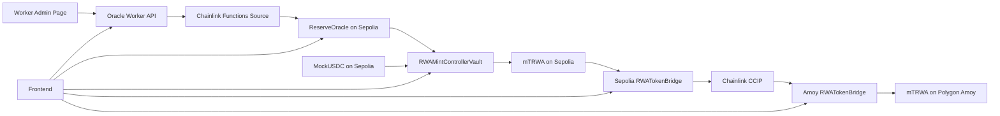

# Architecture

The demo connects off-chain reserve data, on-chain reserve accounting, mint/redeem flows, and cross-chain token movement.

## Components

## Reserve Update Flow

1. A user edits reserve inputs on the worker admin page.
2. The worker stores the latest report in Cloudflare KV.
3. The frontend reads the worker API and compares its `attestationHash` with the on-chain oracle hash.
4. If hashes differ, the frontend indicates that an on-chain update is available.
5. A user calls `ReserveOracle.requestReserveUpdate()` on Sepolia.
6. The oracle stores adjusted reserve data for the vault to use.

## Mint Flow

1. User enters a maximum MockUSDC amount.
2. Frontend calls `previewMintWithUSDC(maxUSDCIn)`.
3. User approves MockUSDC to `RWAMintControllerVault` if needed.
4. User calls `mintWithUSDC(maxUSDCIn, minRwaOut)`.
5. The contract transfers only the required MockUSDC amount, not necessarily the full maximum input.

## Redeem Flow

1. User enters a maximum mTRWA amount.
2. Frontend calls `previewRedeem(maxRwaIn)`.
3. User approves mTRWA to `RWAMintControllerVault` if needed.
4. If vault liquidity is sufficient, user calls `redeem(maxRwaIn, minUSDCOut)`.
5. If liquidity is insufficient, user calls `requestRedeem(maxRwaIn)`.
6. The contract burns only the required mTRWA amount, not necessarily the full maximum input.

## Bridge Flow

1. User selects Sepolia to Amoy, or reverses direction.
2. Frontend previews the sponsored LINK fee from the bridge.
3. User approves source-chain mTRWA to the source bridge if needed.
4. User calls `sendTokenSponsored(...)`.
5. The frontend parses the transaction receipt for the CCIP message ID.
6. Sepolia remains the canonical issuing chain; Amoy is the destination-chain representation.
